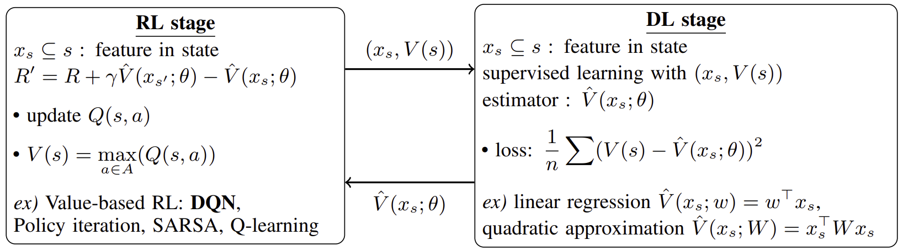
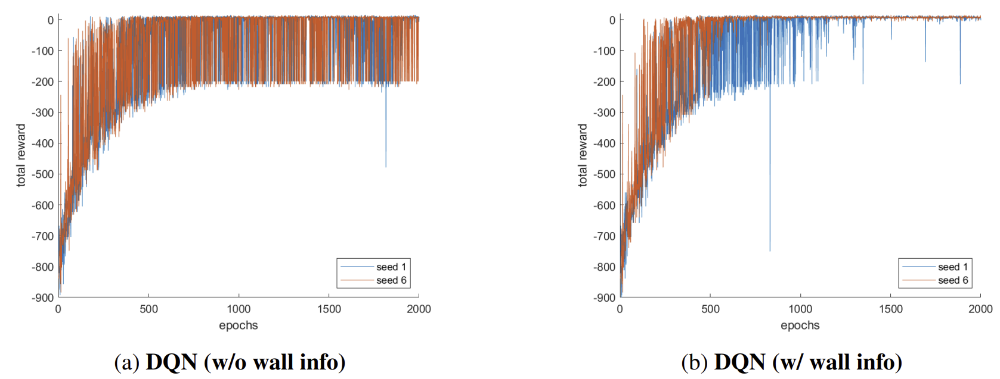
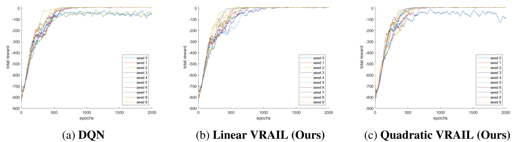
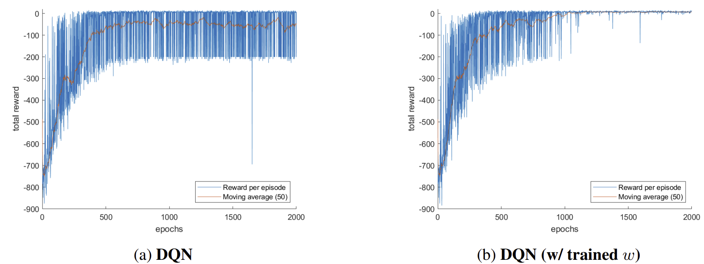
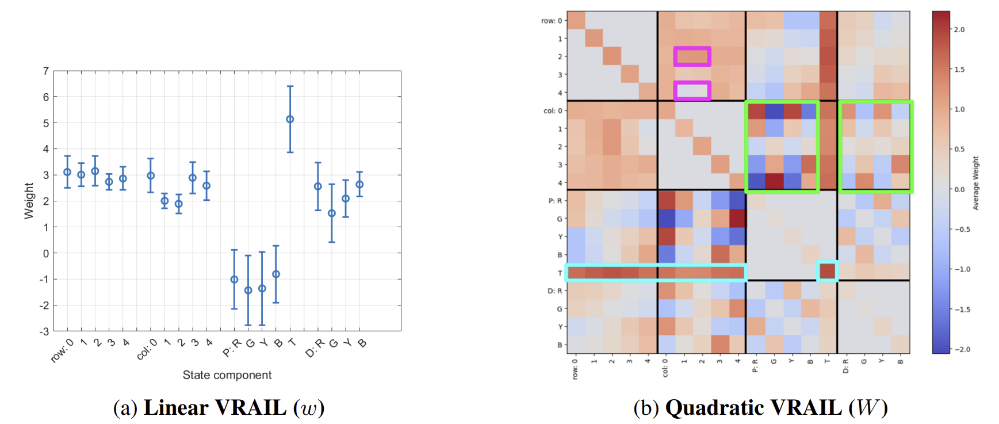

# VRAIL: Vectorized Reward-based Attribution for Interpretable Learning

Official implementation of **_VRAIL: Vectorized Reward-based Attribution for Interpretable Learning_ [[arXiv]](https://arxiv.org/abs/2506.16014) [[slide]](https://drive.google.com/file/d/1th0FzY0WbpATT7SdJMwVqOIlV8qA40Kv/view?usp=sharing)**.

> 🏫 [Jina Kim*](https://jina0218.github.io/), 🏫 [Youjin Jang*](https://github.com/jangyoujin0917), 🏫 [Jeongjin Han*](https://github.com/Jeong-jin-Han)

> 🏫 [KAIST](https://www.kaist.ac.kr/en/), *Equal contribution



We propose **VRAIL (Vectorized Reward-based Attribution for Interpretable Learning)**, a **bi-level framework for value-based reinforcement learning (RL)** that learns **interpretable weight representations** from state features.  
VRAIL consists of two stages:  
- a **deep learning (DL) stage** that fits an estimated value function using state features, and  
- an **RL stage** that uses this to shape learning via **potential-based reward transformations**.  

The estimator is modeled in either linear or quadratic form, allowing attribution of importance to individual features and their interactions. Empirical results on the **Taxi-v3 environment** demonstrate that VRAIL improves **training stability** and **convergence** compared to standard DQN, without requiring environment modifications. Further analysis shows that VRAIL uncovers semantically meaningful subgoals (such as passenger possession), highlighting its ability to produce **human-interpretable behavior**. Our findings suggest that VRAIL serves as a **general, model-agnostic framework** for reward shaping that enhances both learning and interpretability.


---

## Motivation
In reinforcement learning, agents often struggle when **state representations are incomplete** or **reward signals are sparse/delayed**.  

For example, in the **Taxi-v3** environment:  
- The default state space lacks **wall information**, which is crucial for successful navigation.  
- A vanilla DQN baseline sometimes fails to converge (2 out of 10 runs).  
- When wall information is manually added, DQN converges consistently — but such interventions are impractical in real-world settings.  

**VRAIL addresses this challenge** by learning **feature-based reward shaping functions** that uncover latent subgoals (e.g., “passenger is in taxi”), stabilizing training **without modifying the environment**.

  
*Figure: Effect of wall information on DQN convergence. Without wall info, DQN fails in some runs; VRAIL achieves stability without modifying the environment.*

---

## Key Features
- **Bi-level Optimization**:  
  - **RL Stage**: Learns policies with shaped rewards.  
  - **DL Stage**: Fits an interpretable value function from state features (linear or quadratic).  
- **Interpretability**: Produces **weight vectors** and **feature interactions** that highlight important factors in decision-making.  
- **Training Stability**: More robust convergence compared to vanilla DQN.  
- **Model-Agnostic**: Can be applied to value-based RL methods (DQN, SARSA, Q-learning, etc.).  
- **Generalizable Reward Shaping**: Learned shaping functions can be transferred to other agents.

---

## Method Overview
VRAIL alternates between two stages:

1. **RL Stage**  
   Reward shaping with a potential function:
   `R'(s, a, s') = R(s, a, s') + γ V̂(x_{s'}; θ) − V̂(x_s; θ)`

   - Uses any value-based RL algorithm (e.g., DQN).  
   - Encourages intermediate progress toward the final goal.  

2. **DL Stage**  
   Learns interpretable value functions:  
   - **Linear VRAIL**:  `V̂(x_s; w) = wᵀ x_s`
   - **Quadratic VRAIL**:  `V̂(x_s; W) = x_sᵀ W x_s`

   - Attributes importance to features and feature interactions.  

This forms a **closed-loop bi-level optimization** between RL and DL stages.

---

## Experiments
- **Environment**: [Taxi-v3 (Gymnasium)](https://gymnasium.farama.org/environments/toy_text/taxi/)  
- **Baselines**: Compared against vanilla DQN.  
- **Results**:
  - **Linear VRAIL**: Highest robustness (converged in 10/10 seeds).  
  - **Quadratic VRAIL**: Fastest convergence speed.  
  - **Transferability**: Pretrained VRAIL reward functions improve vanilla DQN convergence.  

**Example Findings**:
- Linear VRAIL learns that **"Passenger in Taxi"** is the most important subgoal.  
- Quadratic VRAIL highlights **feature interactions** between location, passenger, and destination.  

---

## Results
- **Linear VRAIL**: Most stable (converged in all runs), but slightly slower.  
- **Quadratic VRAIL**: Faster convergence and highly robust, though not as perfectly stable as Linear.  


### Training Stability Comparison Across Models
- VRAIL improves convergence robustness compared to DQN:  
  - DQN: 8/10 runs  
  - Linear VRAIL: 10/10 runs  
  - Quadratic VRAIL: 9/10 runs  



### Average epochs to reach reward thresholds (10 seeds, excluding top/bottom 2 outliers)

| Reward Threshold | DQN | Linear VRAIL | Quadratic VRAIL |
|------------------|-----|--------------|-----------------|
| -10              | 600.00 | 614.17 | **538.17** |
| -5               | 612.17 | 643.17 | **562.83** |
| 0                | 648.17 | 652.50 | **594.33** |
| +5               | 717.67 | 735.83 | **660.17** |

---

### Effect of Reward Shaping Using a Pretrained Linear VRAIL Model
A pretrained Linear VRAIL shaping function, when transferred to DQN, improves stability and eliminates non-converging runs.  



---

### Visualization of Learned Parameters of DL Stage
- **Linear VRAIL**: Feature weights highlight **passenger possession** as the most important subgoal.  
- **Quadratic VRAIL**: Heatmap of pairwise feature interactions shows strong coupling between **passenger and destination features**.  



---

## Team Contributions
All team members actively contributed to every stage of the project, including project concretization,
trials for method improvement, slides, and report writing. Further individual contributions are detailed
below.
- Jina Kim : Backbone model implementation (Linear VRAIL), DQN toy experiment (Fig 1),
self-attention based model trials.
- Youjin Jang : Idea proposal (vectorized rewards), presentation, quiz creation, visualization (graphs,
diagrams).
- Jeongjin Han : Interpretation of learned parameters of DL stage, effect of shaped reward experiment
(Fig 4), α-scheduling trials, environment variants trials.

## Citation

```BibTeX
@misc{kim2025vrailvectorizedrewardbasedattribution,
      title={VRAIL: Vectorized Reward-based Attribution for Interpretable Learning}, 
      author={Jina Kim and Youjin Jang and Jeongjin Han},
      year={2025},
      eprint={2506.16014},
      archivePrefix={arXiv},
      primaryClass={cs.LG},
      url={https://arxiv.org/abs/2506.16014}, 
}
```
